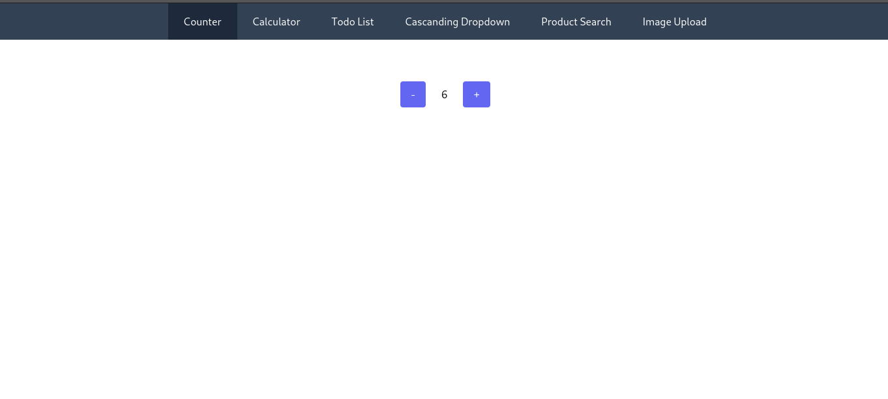
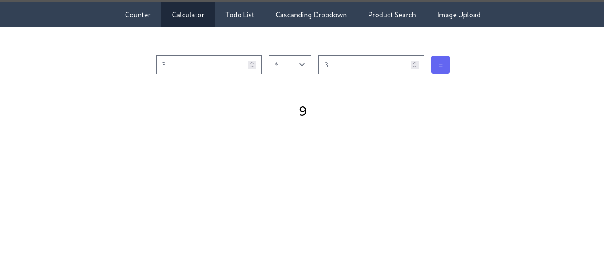
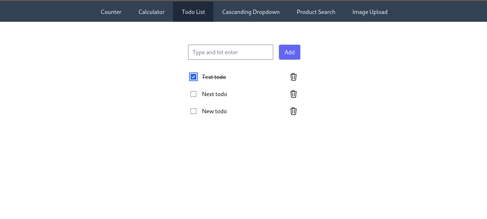
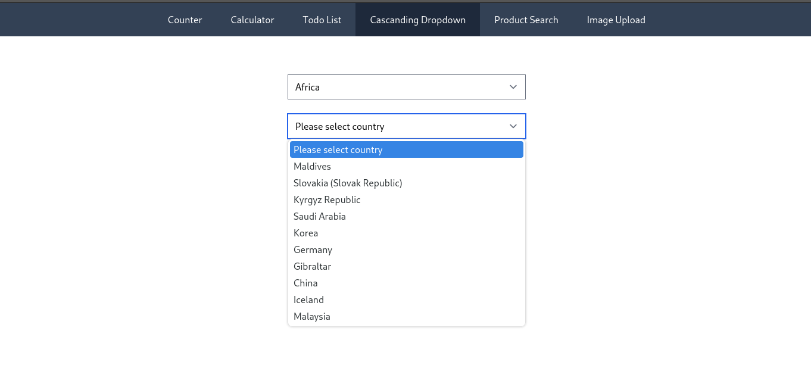
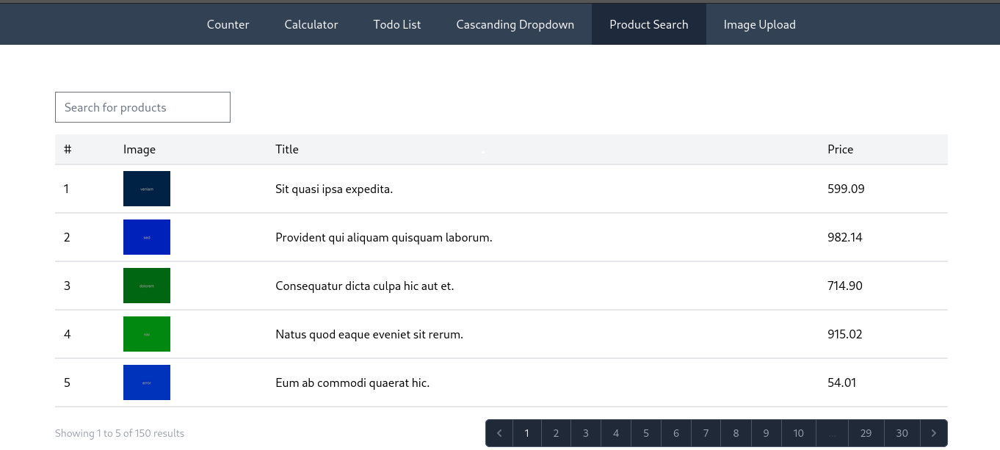
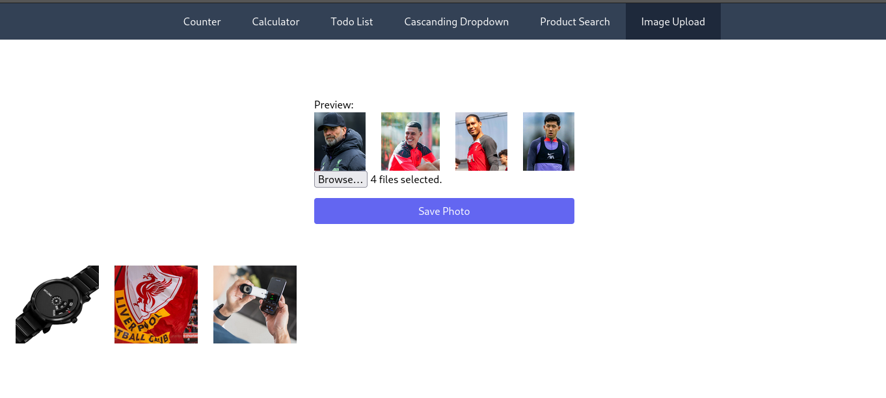
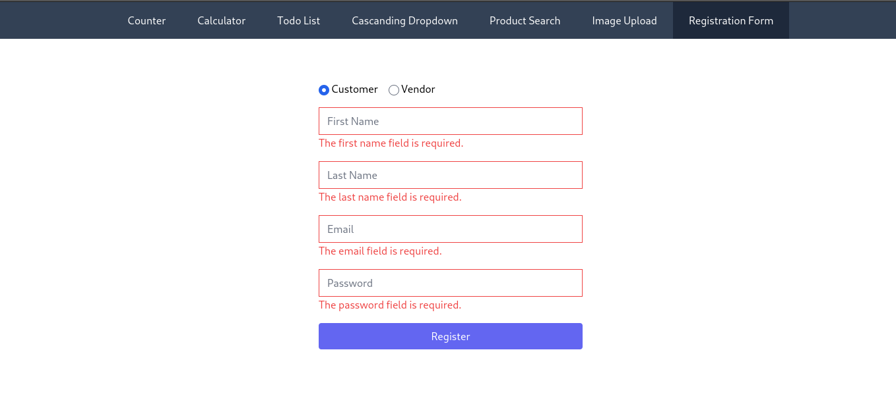
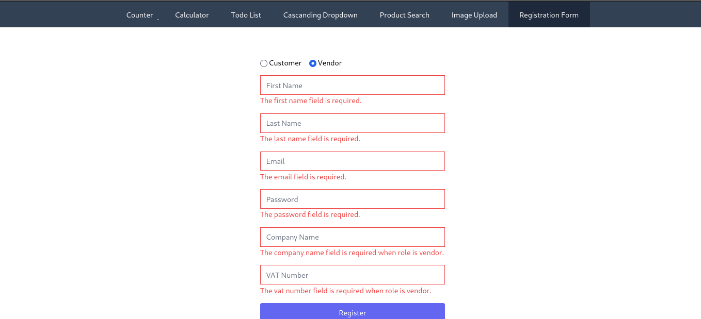
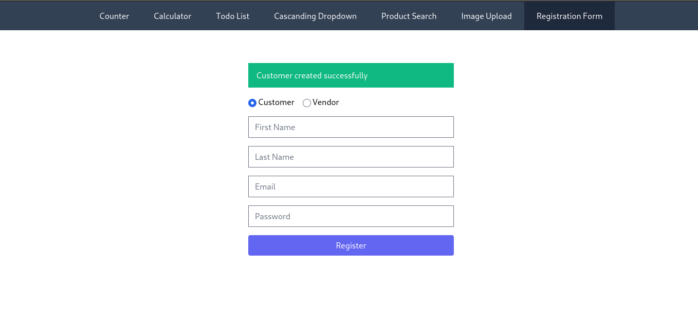

# LivewireBooster

**LivewireBooster** is a repository that features five practical projects designed to help get hands-on experience with Laravel and Livewire. Each project tackles a different use case commonly encountered in web development, providing with a solid foundation to build upon.

## Projects Included

### 1. Counter
A simple counter that demonstrates the basics of Livewire components, data binding, and state management. This project is perfect for beginners to get started with Livewire.

### 2. Todo List
A classic to-do list application where you can add, edit, and mark tasks as complete. This project highlights CRUD operations, real-time updates, and data persistence using Eloquent models.

### 3. Calculator
A basic calculator that performs arithmetic operations like addition, subtraction, multiplication, and division. This project is great for learning about form handling, user input validation, and displaying dynamic results.

### 4. Product Search
A product search feature that allows users to search through a list of products. It includes pagination and dynamic filtering, demonstrating more advanced use cases like query strings and model queries.

### 5. Image Upload
An image upload feature where users can upload and manage images. This project covers file handling, validation, and displaying uploaded images, providing a comprehensive understanding of file uploads in Livewire.

### 6. User Registration
A user registration form with validation, authentication, and email verification. This project focuses on user management, form validation, and security features in Laravel and Livewire.

## Screenshots
Below is a screenshots of the project:

